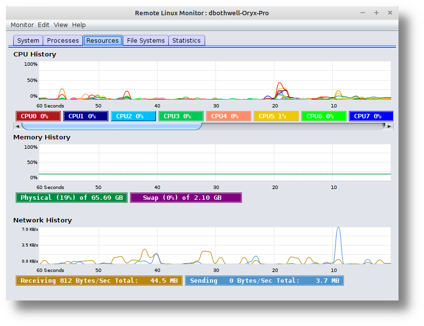
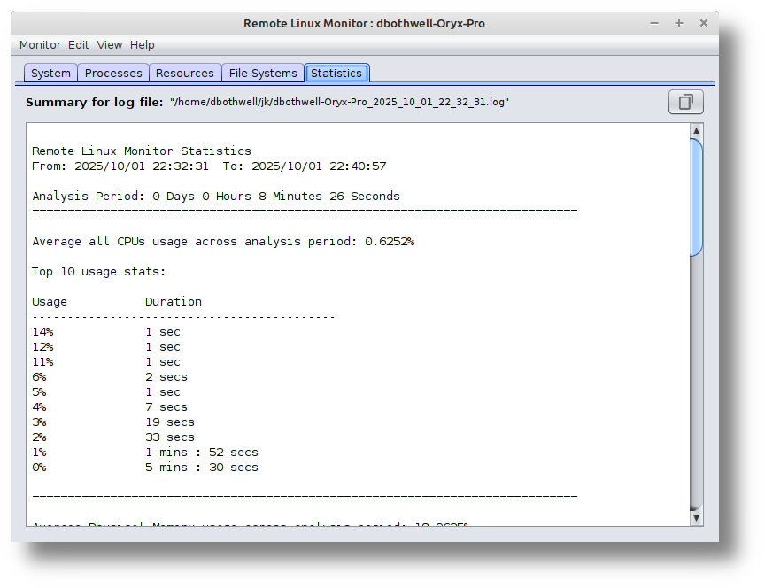

<!DOCTYPE html>
<html lang="en">
<body>
	<header>
		<h2>
			Remote Linux Monitor
		</h2>
	</header>
	

		

			The Remote Linux Monitor's graphical user interface is similar to and inspired by Gnome's System Monitor. All connections are made using a secure shell and there is no agent software to install on the remote server. You can monitor Linux servers from Windows, Mac or Linux clients. The system is ideal for monitoring headless servers.
		

			 
		

	

	

		

			The Remote Linux Monitor can be used to gather and summarize server resource statistics over time.
		

			 
		

    

	

		

			To build a Remote Linux Monitor executable jar. Ensure Maven is installed locally. Download and extract the source code zip file. Change directory to ./remote-linux-monitor-master/RemoteMonitor (The folder containing the pom.xml file) and run the command: "mvn package". The jar will be created in the target directory. Set the jar's permission's executable bit.
        

	

</body>
</html>
